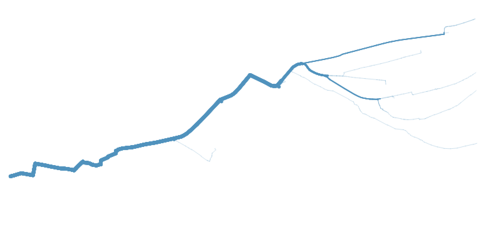

# QGIS resources

A collection of QGIS colour schemes, layer styles, map templates, symbols, and server urls.

## Server URLs

Download the xml files from the following list by clicking on the link > clicking on Raw and then Save as in your browser.

- [WMS Server URLs](source/server-urls/wms_server.xml)
- [WCS Server URLs](source/server-urls/wcs_server.xml)
- [WFS Server URLs](source/server-urls/wfs_server.xml)

### Importing server URLs into QGIS 3

Import the xml files into QGIS by launching QGIS and clicking on the symbol beneath the new file symbol (Datenquellenverwaltung öffnen).

Then click on the tab of the server type (WMS, WCS or WFS) you want to edit and click on Load (Laden). Next, select the downloaded xml file that matches the selected server type (WMS => wms_server.xml, WFS => wfs_server.xml).

Now you can select one of the imported server from the dropdown list and connect to it by clicking on Connect (Verbinden). Select a layer and click on Add (Hinzufügen).

## Processing scripts and models

### Network analysis

<<<<<<< HEAD
#### Weight network processing model
=======
#### Weight network
>>>>>>> b2fe590184dbb340f9aa38e60fb00ddf44d25c39

You need to load all of the following processing models to QGis3 to run the Weight routed network process:

- [Explode polylines](source/processing/models/network_analysis-explode_polylines.model3)
- [Count overlapping segments](source/processing/models/network_analysis-overlapping_segments_count.model3)
- [Weight routed network](source/processing/models/network_analysis-weight_routed_network.model3)
