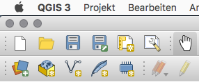
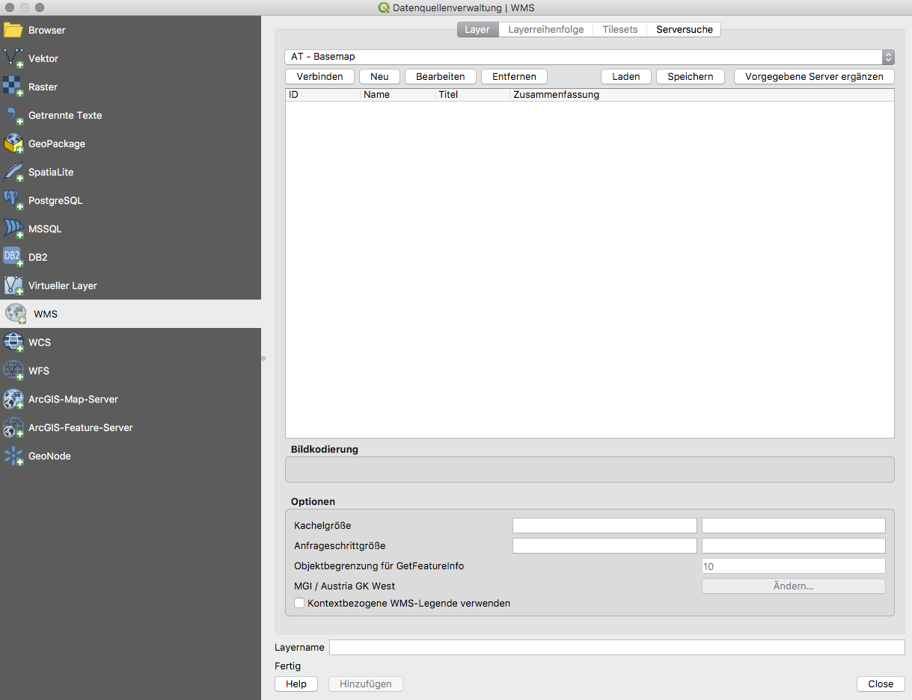
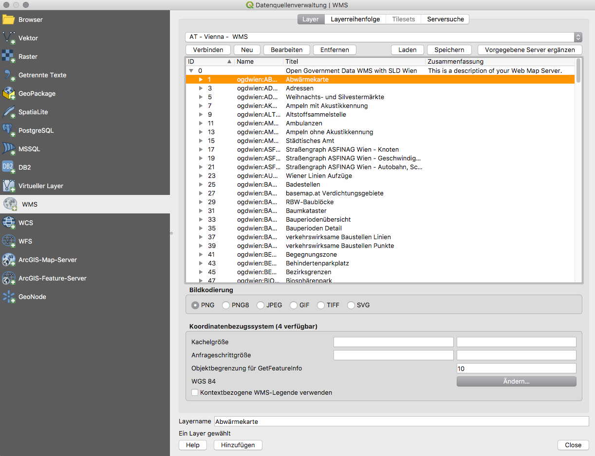

# QGIS resources

A collection of QGIS colour schemes, layer styles, map templates, symbols, and server urls.

## Server urls
Download the xml files from the following list by clicking on the link > clicking on Raw and then Save as in your browser.

- [WCS Server URLs](source/server-urls/wcs_server.xml)
- [WFS Server URLs](source/server-urls/wfs_server.xml)
- [WCS Server URLs](source/server-urls/wms_server.xml)

Next, import the xml files into QGIS by launching QGIS and clicking on the symbol beneath the new file symbol (Datenquellenverwaltung öffnen).

Then click on the tab of the server type (WMS, WCS or WFS) you want to edit and click on Load (Laden). Next, select the downloaded xml file that matches the selected server type (WMS => wms_server.xml, WFS => wfs_server.xml).

Now you can select one of the imported server from the dropdown list and connect to it by clicking on Connect (Verbinden). Select a layer and click on Add (Hinzufügen).

### Importing Server URLs into QGIS 2
